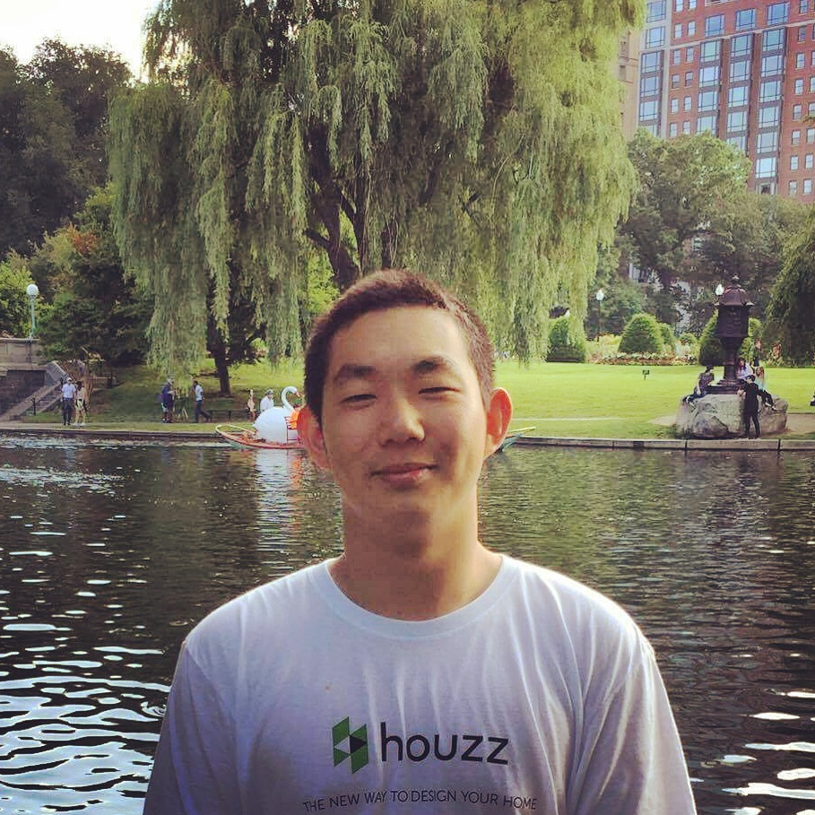

## rogerji110.github.io

# Roger Ji's User Page

**My favorite programming language is Python**

*My favorite quote is by Oscar Wilde:*
>Be yourself; everyone else is already taken.

My favorite Unix command is `rm -rf *`

My favorite website is [Reddit](https://reddit.com).

### This is another section heading
Hopefully it links correctly to above.

Check out my other markdown file [here](OTHER.md)

Some other things about me:
- I'm a sophomore studying CS
- I'm from the Bay Area
- I've two dogs and one cat :)

My favorite things to do include:
1. Lifting
2. Playing with my pets
     - Oski (dog #1)
     - Goji (cat)
     - Noodle (dog #2)
3. Sleeping

Things I want to accomplish in 2021:
- [ ] Spend more time investing in stocks
- [ ] Do more cardio
- [ ] Play less video games
- [x] ~Find an internship~
 

